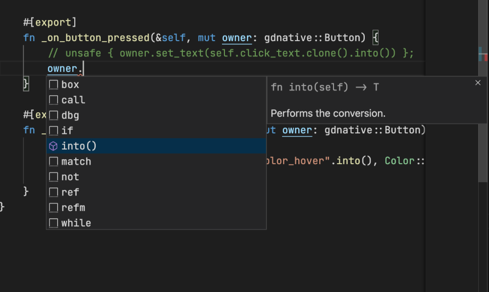
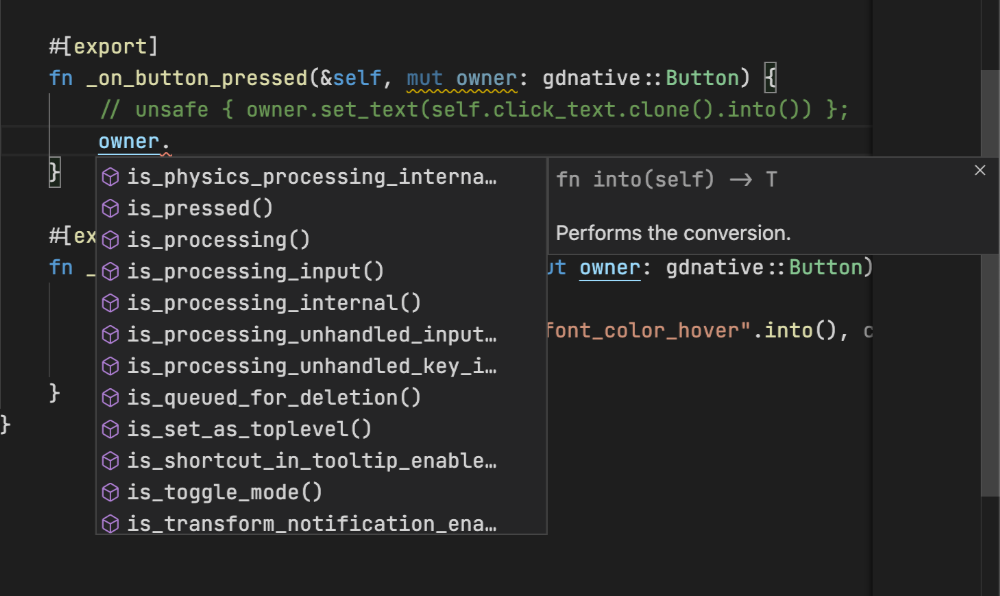

# FAQ: Configuration

## Table of contents
<!-- toc -->

## How do I create the library file for my GDNative binary?

You can create .gdnlib files with either of the following methods.

### Editor

1. In the editor, right click in the File System and Select _New Resource_. 
2. Select _GDNativeLibrary_ from the menu.
3. Save as new GDNativeLibrary. The typical file extension is `.gdnlib`.
4. Select the GDNativeLibrary.
5. For each desired target, select a path to the location of the library created by Cargo.

### Manual

Create a text file with the `.gdnlib` extension with the following content.
Please note: you only need to include paths for the targets you plan on building for.

```toml
[entry]
X11.64="res://path/to/lib{binary-name}.so"
OSX.64="res://path/to/lib{binary-name}.dylib"
Windows.64="res://path/to/{binary-name}.dll"

[dependencies]
X11.64=[  ]
OSX.64=[  ]
Windows.64 = [ ]

[general]
singleton=false
load_once=true
symbol_prefix="godot_"
reloadable=true
```


## Once I create the `.gdnlib` file, how do I create the native script, so that I can attach it to the nodes in the scene tree?

Script files can be created in two ways.

1. From the editor.
2. Manually by creating a `.gdns` file with the following code snippet.
```toml
[gd_resource type="NativeScript" load_steps=2 format=2]

[ext_resource path="res://path/to/{filename}.gdnlib" type="GDNativeLibrary" id=1]

[resource]
resource_name = "{class-name}"
class_name = "{class-name}"
library = ExtResource( 1 )
```


## C headers not found by bindgen

When building the library, `bindgen` may produce errors that look like this:

```
godot-rust/gdnative-sys/godot_headers/gdnative/string.h:39:10: fatal error: 'wchar.h' file not found
```

This means that `bindgen` was unable to find the C system headers for your platform. If you can locate the headers manually, you may try setting the `C_INCLUDE_PATH` environment variable so `libclang` could find them. If on Windows, you may try building from the Visual Studio "developer console", which should setup the appropriate variables for you.


## Why aren't my scripts showing up in the _Add Node_ portion of the editor, even though they inherit from  `Node`, `Node2D`, `Spatial` or `Control`?

Due to limitations with Godot 3.x's version of GDNative, NativeScript types do not get registered in the class database. As such, these classes are not included in the _Create New Node_ dialog.

A workaround to this issue has been included in the recipe [Custom Nodes Plugin](../recipes/custom-node-plugin.md).


## Can I use Rust for a [tool script](https://docs.godotengine.org/en/stable/tutorials/misc/running_code_in_the_editor.html)?

Yes, any Rust struct that inherits from `NativeClass` can be also used as a tool class by using the `InitHandle::add_tool_class` during native script initialization instead of `InitHandle::add_class`.

```rust
#[derive(NativeClass)]
#[inherit(Node)]
stuct MyTool {}
#[methods]
impl MyTool {
    fn new (_owner: &Node) -> Self {
        Self {}
    }
}

fn init(handle: InitHandle) {
    handle.add_tool_class::<InitHandle>();
}
```

Please also see the [native-plugin](https://github.com/godot-rust/godot-rust/tree/master/examples/native-plugin) that is the Rust version of the [editor plugin](https://docs.godotengine.org/en/stable/tutorials/plugins/editor/index.html) tutorial.

**Important**

- Editor plugins do not support the hot reload feature. If making use of tool classes, your `GDNativeLibrary` must have `reloadable=false` or the plugins will crash when the editor loses focus.
- It is advised that `GDNativeLibrary` files for editor plugins be compiled as a separate "cdylib" from the `GDNativeLibrary` that may need to be recompiled during development, such as game logic.


## Is it possible to use multiple libraries with GDNative?

Yes. This is possible, but it should be avoided unless necessary. Generally you should create one `GDNativeLibrary` (`.gdnlib`) and associate many `NativeScript` (`.gdns`) files with the single library.

The most common use-case for using multiple `GDNativeLibrary` files is when creating editor plugins in Rust that are either intended for distribution or cannot be hot reloaded.

If you do have a scenario that requires multiple `GDNativeLibrary`, you can create as many libraries as you need for your project. Be mindful that it is possible for name collision to occur when loading from multiple dynamic libraries. This can occur in the event that multiple libraries attempt to register the same class in their init function.

To avoid these collisions, rather than the `godot_init!` initialization macro, prefer the use of the individual macros.

For example, if we want to define the symbol_prefix for our library "my_symbol_prefix", we can use the macros below.

```rust
// _ indicates that we do not have any specific callbacks needed from the engine for initialization. So it will automatically create
// We add the prefix onto the `gdnative_init` which is the name of the callback that Godot will use when attempting to run the library
godot_gdnative_init!(_ as my_symbol_prefix_gdnative_init);
// native script init requires that the registration function be defined. This is commonly named `fn init(init: InitHandle)` in most of the examples
// We add the prefix onto the `native_script_init` which is the name of the callback that Godot will use when attempting to intialize the script classes
godot_nativescript_init!(registration_function as my_symbol_prefix_nativescript_init);
// _ indicates that we do not have any specific callbacks needed from the engine for initialization. So it will automatically create
// We add the prefix onto the `gdnative_terminate` which is the name of the callback that Godot will use when shutting down the library
godot_gdnative_terminate!(_ as my_symbol_prefix_gdnative_terminate);
```

## Can I expose {insert Rust crate name} for use with Godot and GDScript?

Yes, with NativeScript so long as you can create a `NativeScript` wrapper you can create GDScript bindings for a Rust crate. See the [logging recipe](../recipes/logging.md) for an example of wrapping a Rust logging crate for use with GDScript.


## How do I get auto-completion with rust-analyzer?

`godot-rust` generates most of the gdnative type's code at compile-time. Editors using [rust-analyzer](https://github.com/rust-analyzer/rust-analyzer) struggle to autocomplete those types:




People [reported](https://github.com/rust-analyzer/rust-analyzer/issues/5040) similar issues and found that switching on the `"rust-analyzer.cargo.loadOutDirsFromCheck": true` setting fixed it:




## How do I get auto-completion with IntelliJ-Rust plugin?

Similar to rust-analyzer, IntelliJ-Family IDEs struggle to autocomplete gdnative types generated at compile-time.

There are two problems preventing autocompletion of gdnative types in IntelliJ-Rust.

First, the features necessary are (as of writing) considered experimental and must be enabled. Press `shift` twice to open the find all dialog and type `Experimental features...` and click the checkbox for `org.rust.cargo.evaluate.build.scripts`.  Note that `org.rust.cargo.fetch.out.dir` will also work, but is known to be less performant and may be phased out.

Second, the bindings files generated (~8mb) are above the 2mb limit for files to be processed. As [reported](https://github.com/intellij-rust/intellij-rust/issues/6571#) you can increase the limit with the steps below.
* open custom VM options dialog (`Help` | `Find Action` and type `Edit Custom VM Options`)
* add `-Didea.max.intellisense.filesize=limitValue` line where `limitValue` is desired limit in KB, for example, 10240. Note, it cannot be more than 20 MB.
* restart IDE


## How can I make my debug builds more performant?

**Note**: These changes may slow down certain aspects of the build times for your game.

Some simple ways to make your debug builds faster is to update the following profiles in your workspace cargo file.

```toml
[profile.dev.package."*"]
opt-level = 3

[profile.dev]
opt-level=1
```
